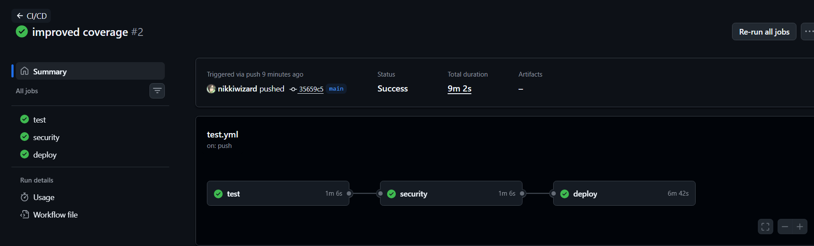
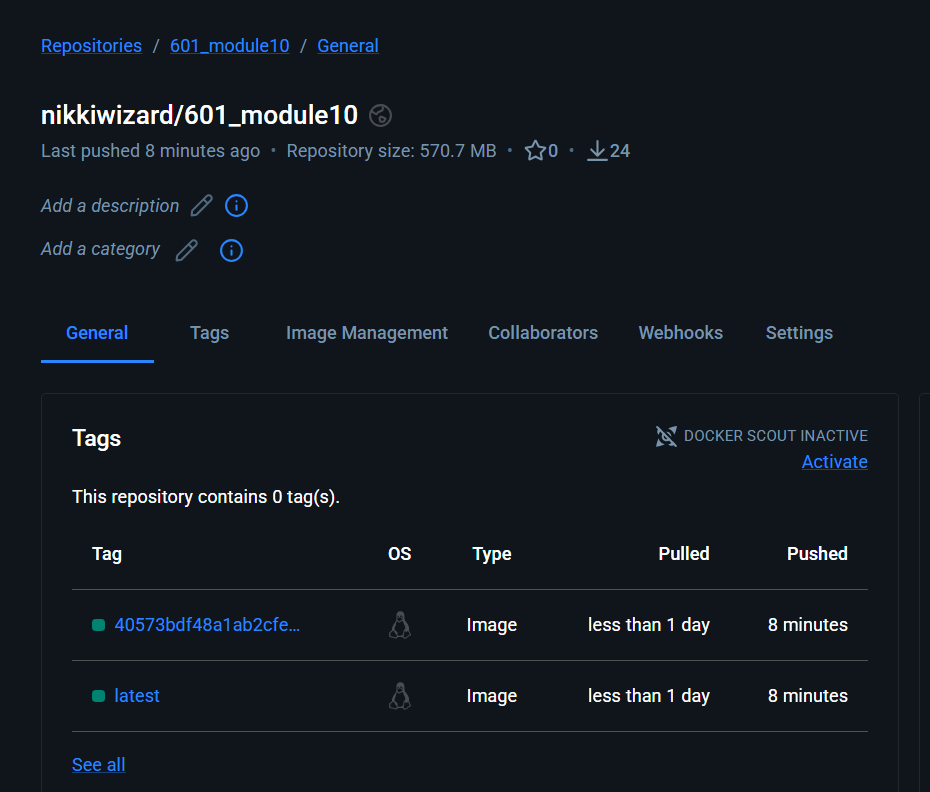

## Module 11

## DockerHub URL:
https://hub.docker.com/repository/docker/nikkiwizard/601_module10/general

## Github Actions Run:

## DockerHub Screenshot:

## Running Tests
To run tests locally, follow these commands:
python3 -m venv venv
source venv/bin/activate
pip install -r requirements.txt
pytest